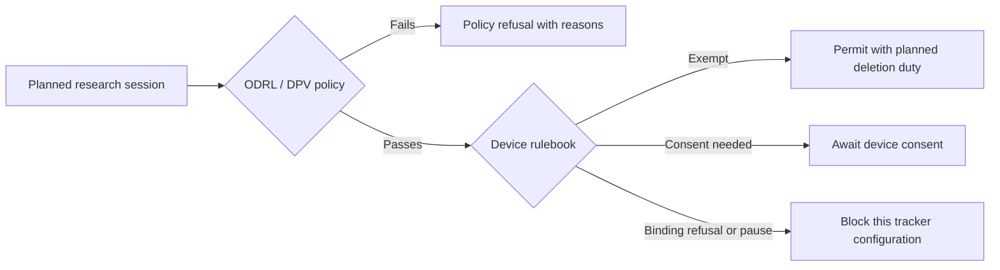

# A research portal under two rulebooks

*One hospital. One research policy. What changes when the device rules change?*

[program](https://github.com/eyereasoner/eyedia/blob/main/examples/research-portal.pl) · [output](https://github.com/eyereasoner/eyedia/blob/main/examples/output/research-portal.pl) · [proof](https://github.com/eyereasoner/eyedia/blob/main/examples/proof/research-portal.pl) · [check](https://github.com/eyereasoner/eyedia/blob/main/examples/check/research-portal.pl) · [playground](https://eyereasoner.github.io/eyedia/playground/#example=research-portal)

---

## The question

A hospital's research portal serves sensitive lab records to consortium
members. Its policy requires research purposes, consent, pseudonymisation,
and access before 2027. Some sessions also involve audience measurement or
advertising trackers.

**If the digital rules change, which sessions can proceed, which still need
consent, and which remain blocked? What happens if portal data is breached?**

An ODRL/DPV research policy and a Digital Omnibus comparison form one
self-contained decision process.

---

## Two gates, with different jobs



Consent to research and consent to device access are separate inputs. An
exemption for audience measurement cannot supply withdrawn research consent.
A blocked tracker configuration can be changed; the model does not say the
research itself must be refused when an optional tracker can be removed.

---

## The hospital policy stays fixed

The ODRL agreement permits consortium members to use lab results for DPV
research purposes when consent is given and pseudonymisation is in place.
It prohibits marketing distribution and all use by the US partner. If a
permission and prohibition overlap, `odrl:prohibit` wins.

The facts carry the meanings:

```prolog
process('ex:r1', 'ex:partnerBE', 'dpv:Use', 'ex:labResults',
        'dpv:AcademicResearch', 'dpv:ConsentGiven',
        'dpv:Pseudonymisation', 20261115).
session('ex:r1', own_audience_measurement, first_visit).
```

The process describes the research use. The session describes the device
access that accompanies it. DPV purpose matching follows `skos:broader`.
Missing constraint values or definitions prevent a policy permit.

---

## The device rulebook changes

The baseline applies the general ePrivacy consent rule. The comparison uses
the **original Commission proposal of 19 November 2025**, COM(2025) 837 final,
as a hypothetical rulebook after the relevant provisions become applicable.

Its modelled changes include an exception for necessary, aggregated audience
measurement solely for the controller's own use; respect for browser signals;
and a pause of at least six months after a same-purpose refusal.

The hospital portal is not a media service provider. Completed calendar
months are supplied as input. National exceptions, transitional dates and
later negotiating texts are outside this comparison.

---

## Ten sessions, twenty assessments

| Session | What matters | EU baseline | Original proposal |
| --- | --- | --- | --- |
| r1 | Valid research; own aggregated audience measurement | Await device consent | Permit with duty |
| r2 | Personalised advertising as the data-use purpose | Policy refusal | Policy refusal |
| r3 | Share records for marketing | Prohibited | Prohibited |
| r4 | Research consent withdrawn; own audience measurement | Policy refusal | Policy refusal |
| r5 | Encryption instead of pseudonymisation; expired date | Policy refusal | Policy refusal |
| r6 | US partner; otherwise valid research | Prohibited | Prohibited |
| r7 | Valid research; advertising tracker; browser refusal | Await device consent | Block by signal |
| r8 | Valid research; advertising tracker; refusal 5 months ago | Await device consent | Do not ask again |
| r9 | Valid research; advertising tracker; refusal 6 months ago | Await device consent | May ask again |
| r10 | Valid research; strictly necessary requested-service access | Permit with duty | Permit with duty |

“Await device consent” never authorises processing without consent. It is the
baseline next step, not a finding that an existing refusal may be ignored.

---

## The change that connects both examples

```prolog
changed(session('ex:r1'),
        from(await_device_consent('ex:research')),
        to(permit('ex:research'))).
planned_duty(omnibus_proposal, 'ex:r1', 'odrl:delete', within_days(90)).
```

The policy already permits r1's research use. The proposal changes its device
step, so the combined plan can proceed and carries the deletion obligation.

Compare r4: the same device exemption applies, but research consent was
withdrawn. The policy refusal remains in both regimes. Compare r6: its policy
permission is overridden by the prohibition, which `policy_conflict/2` records.

---

## Incidents are a separate responsibility

Three incidents concern data already held by the portal. They are evaluated
even when a planned session is refused.

| Assessed risk | EU baseline authority notification | Original proposal authority notification | Affected people |
| --- | --- | --- | --- |
| Unlikely | None | None | None |
| Some | 72-hour limit | None | None |
| High | 72-hour limit | 96-hour limit via single entry point | Without undue delay in both |

Every `breach_plan/5` includes `document_breach`, even when no recipient must
be notified. Deadlines run from awareness, apply where feasible and accompany
the duty to act without undue delay. No Art. 34(3) exception applies to the
high-risk case. Risk is an assessed input, not inferred from the incident name.

---

## What the certificate establishes

The output has **35 claims**: 20 assessments, three planned duties, one policy
conflict, six breach plans and five changes.

The checker checks **223 steps**: 185 verified rule steps, 15 recomputed steps
and **23 trusted collection obligations**. Verdict:
**`checked_with_obligations`**. The collection obligations cover complete
lists of matching permissions, prohibitions and failed constraints.

The certificate checks reasoning from the supplied facts and rules. It does
not establish legal accuracy, valid consent or completed deletion. `permit`
is a planning result; fulfilment of ODRL duty preconditions is outside this
local profile. Only the declared `odrl:prohibit` strategy is supported; other
or missing strategies produce explicit configuration refusals.

---

## Try it

```sh
node bin/eyedia.js examples/research-portal.pl
node bin/eyedia.js --proof examples/research-portal.pl
node bin/eyedia.js --check-proof examples/proof/research-portal.pl examples/research-portal.pl
node bin/eyedia.js --goal "policy_result('ex:r4', Result)" examples/research-portal.pl
```

Change r4's research consent to `dpv:ConsentGiven`: its proposal assessment
becomes a permit. Change r7's tracker kind to `requested_service`: its device
access becomes exempt. These are different changes at different gates.
Regenerate the proof after editing; `--strict-proof` rejects the collection
obligations in this example.

---

## Sources and profile

[ODRL Information Model 2.2](https://www.w3.org/TR/odrl-model/) ·
[ODRL Vocabulary 2.2](https://www.w3.org/TR/odrl-vocab/) ·
[DPV 2.3](https://w3id.org/dpv/2.3/dpv/) ·
[Commission proposal](https://eur-lex.europa.eu/legal-content/EN/TXT/?uri=CELEX:52025PC0837) ·
[ePrivacy Art. 5(3)](https://eur-lex.europa.eu/eli/dir/2002/58/2009-12-19) ·
[GDPR Arts. 33–34](https://eur-lex.europa.eu/eli/reg/2016/679/oj/eng).

The program uses local `ex:` operands and action mappings, single-valued
constraint inputs, valid integer dates and an acyclic purpose taxonomy.
`process/8` asserts consent as the research legal basis. Device scope is
personal data on a natural person's device, with necessity and aggregation
assessed in advance. This is an inspectable comparison of a limited policy
profile and a fixed proposal, rather than a complete compliance evaluator.
